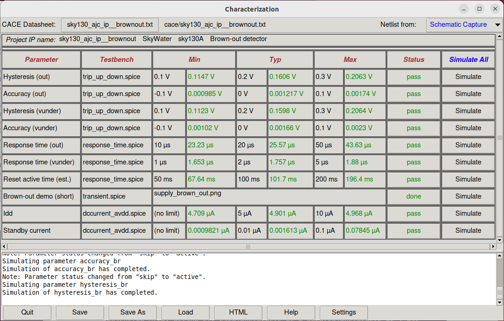
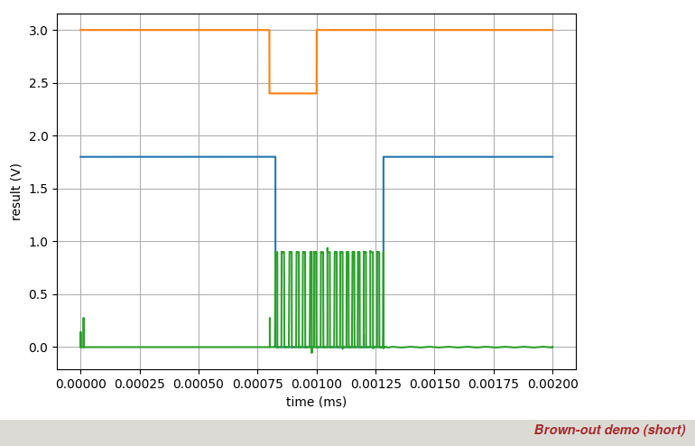
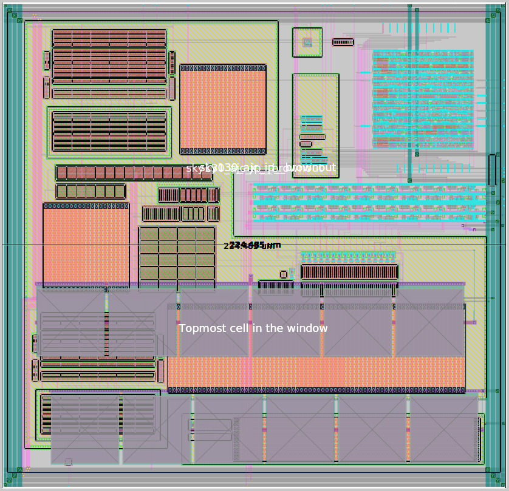
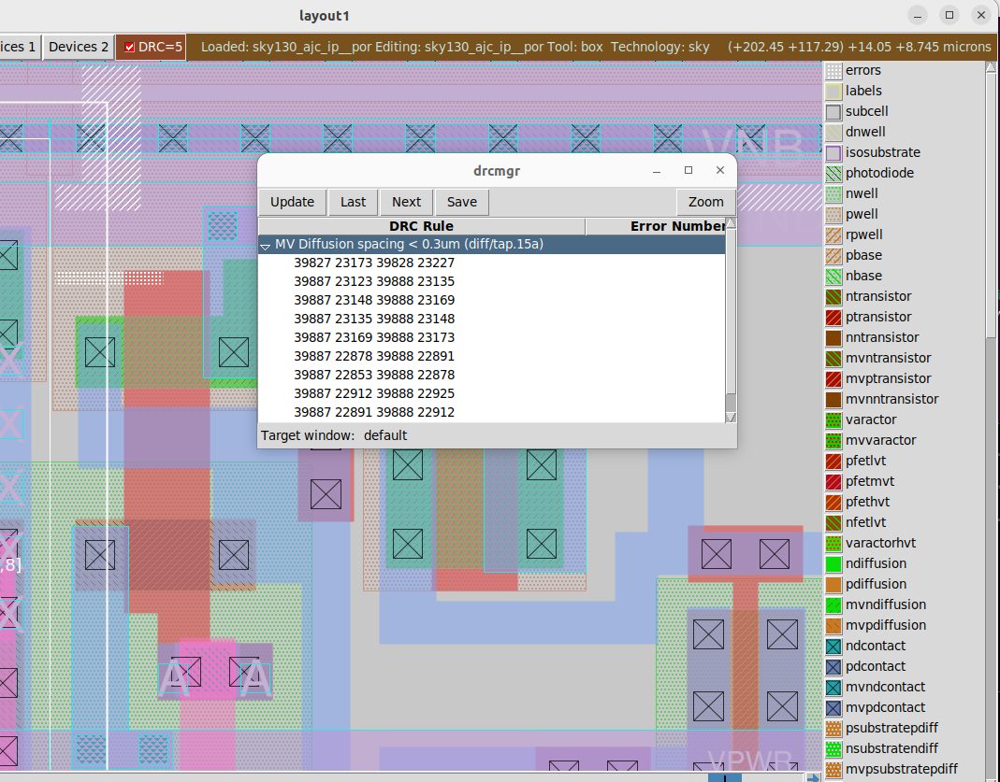
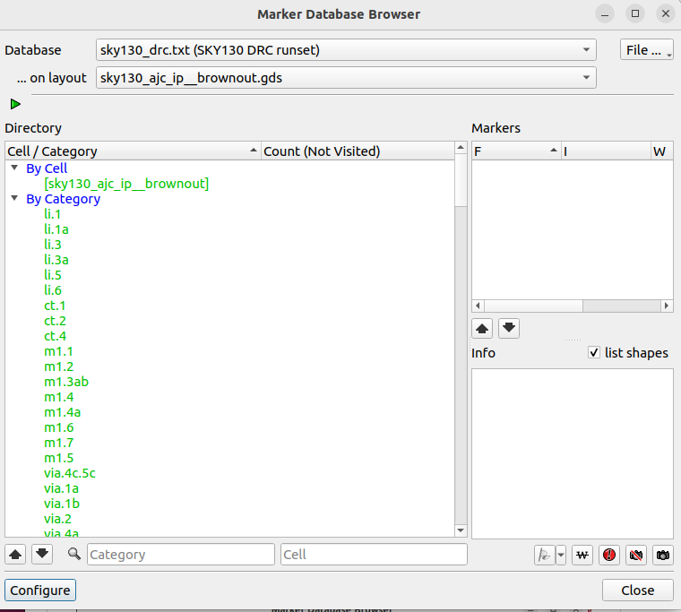
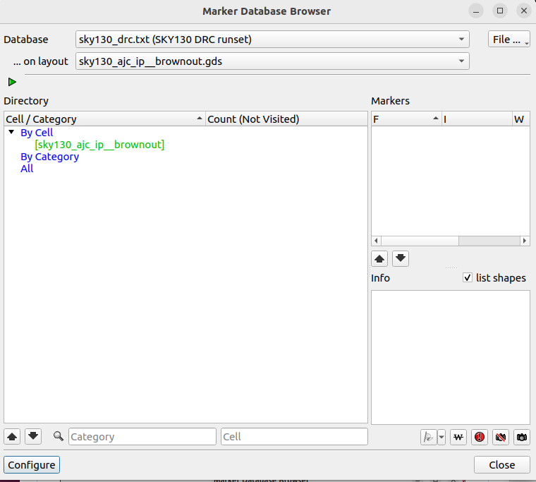
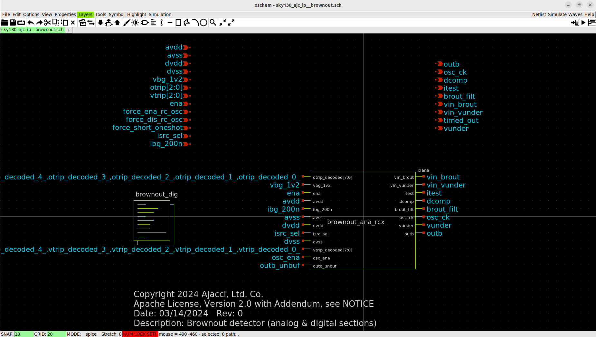
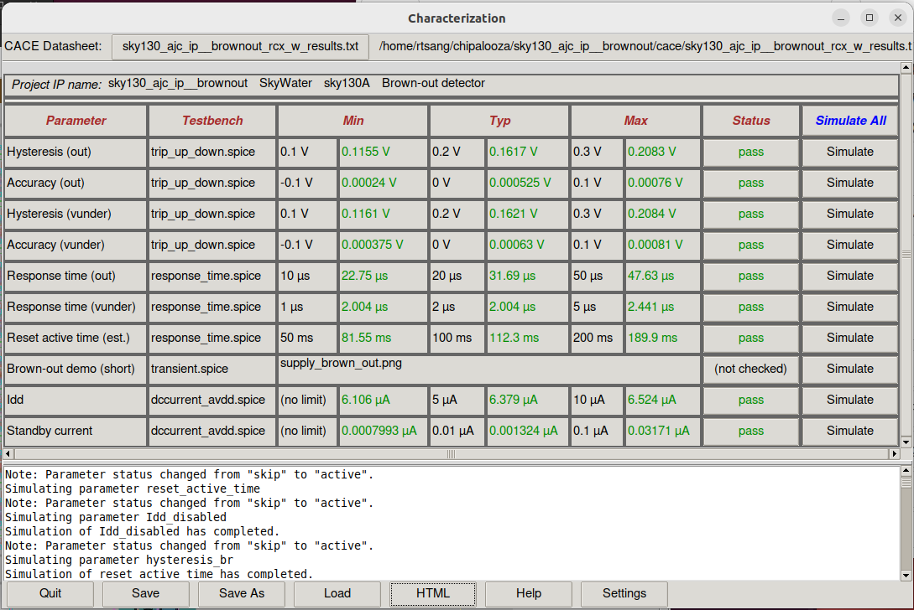
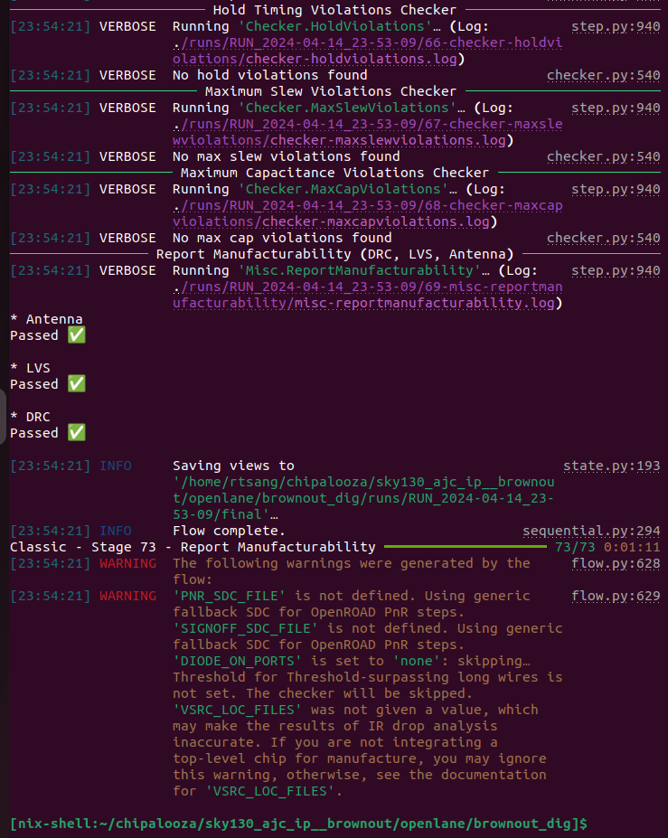

# sky130_ajc_ip__brownout
Brown-out and under-voltage detector for SKY130

This circuit is designed to produce an alarm signal `out` (asserted low) when the power supply `avdd` falls below a selectable trip voltage via `otrip[2:0]`, ranging from 2.4V to 3.0V.

To clone this repository:

`git clone https://github.com/ajcci/sky130_ajc_ip__brownout`

To view a schematic after cloning the repository:

```
cd sky130_ajc_ip__brownout
xschem cace/dccurrent_avdd.sch
```

Run CACE to see simulation results against a set of specifications:

`cace-gui`



Demo of the a temporary glitch on `avdd` (orange), causing the `out` (blue) to assert a reset.  The green trace is `osc_ck`, the internal clock that times the one-shot timer window.  Due to long simulation times, the one-shot timer is significantly shortened from 4096 cycles to 16 cycles using a test mode.


## Layout
The layout was drawn in Magic, so it is best viewed and edited in Magic.

Open layout using Magic by typing the following in the `mag` directory:

`magic -d XR -rcfile $PDK_ROOT/$PDK/libs.tech/magic/sky130A.magicrc sky130_ajc_ip__brownout.mag`

Alternatively, if using Klayout, in base directory, enter the following in the terminal:

`klayout -e gds/sky130_ajc_ip__brownout.gds`


Layout of `sky130_ajc_ip__brownout`, approximate size is 230um x 230um sq.

The gds file is located at `gds/sky130_ajc_ip__brownout.gds`

## Design-Rule-Check (DRC)
DRC is automatic in Magic. Design passes all rules in Magic except the 'MV diffusion spacing rules'. However, according to Tim Edwards at eFabless Inc., these are not actual violations and are false positives, see picture below.


DRC rule violations that are false positives (not actual violations) related to 'MV diffusion spacing'


Check the design using Klayout sky130 DRC deck for consistency:
1. In the Magic Tcl interpreter, run `gds write sky130_ajc_ip__brownout.gds` to stream out a gds file from Magic.
2. Load `sky130_ajc_ip__brownout.gds` into Klayout by running `klayout sky130ajc_ip__brownout.gds`
3. Run sky130A DRC rule deck (assumes Klayout environment is already setup for sky130 pdk, not described here)



Output from Klayout showing no DRC rule violations (all green) for sky130A DRC runset

Some special 'manufacturing rules' are not checked in Magic, so a special 'mr' rule deck in Klayout is used to check for those violations.  Simply load the `sky130A_mr` DRC deck and run to produce the all-pass result pictured below:



Output from Klayout showing no DRC rule violations for sky130A 'mr' DRC rules


## Layout vs Schematic (LVS)
Run using Magic for layout-to-spice netlist extraction, and then Netgen for netlist comparison vs schematic.

Steps taken to perform LVS:

1. Created a blackbox for the digital block `brownout_dig` and replace the xspice model of `brownout_dig` with the blackbox `brownout_dig`.  Save the new schematic as `sky130_ajc_ip__brownout_lvs`.
Netlist out `sky130_ajc_ip__brownout_lvs` in xschem and rename the netlist as `sky130_ajc_ip__brownout_lvs.xschem`.  Edit `sky130_ajc_ip__brownout_lvs.xschem` and add the following lines to the file (change $PDK_ROOT/$PDK to the location of your setup):

```
.include $PDK_ROOT/$PDK/libs.ref/sky130_fd_sc_hvl/spice/sky130_fd_sc_hvl.spice
.include $PDK_ROOT/$PDK/libs.ref/sky130_fd_sc_hd/spice/sky130_fd_sc_hd.spice
```

2. Manually delete the bulk node 'avss' connection of the pnp device in the xschem netlist `sky130_ajc_ip__brownout_lvs.xschem`.

Search for this line in the file:
`XQ1 avss avss net7 avss sky130_fd_pr__pnp_05v5_W0p68L0p68 m=1`

and change it to the following:

`XQ1 avss avss net7 sky130_fd_pr__pnp_05v5_W0p68L0p68 m=1`

This step is necessary because the 'combined' models of the sky130 pdk uses a 4-port connection to sky130_fd_pr__pnp_05v5_W0p68L0p68, but Magic only extracts 3 ports, so we manually delete the bulk node (4th port).

3. Extract the layout in Magic using the following commands in the Tcl interpreter:

```
extract all
ext2spice lvs
ext2spice
```

Magic should generate a file named `sky130_ajc_ip__brownout.spice`

4. Put the files in the same directory (mag/lvs) and run the following command in that directory:

```netgen -batch lvs "sky130_ajc_ip__brownout.spice sky130_ajc_ip__brownout" "sky130_ajc_ip__brownout_lvs.xschem sky130_ajc_ip__brownout_lvs" $PDK_ROOT/$PDK/libs.tech/netgen/sky130A_setup.tcl```

Netgen should produce the following output:


```
Contents of circuit 1:  Circuit: 'sky130_ajc_ip__brownout'
Circuit sky130_ajc_ip__brownout contains 184 device instances.
  Class: sky130_fd_pr__cap_mim_m3_2 instances:   1
  Class: sky130_fd_sc_hd__inv_4 instances:   5
  Class: sky130_fd_pr__pnp_05v5_W0p68L0p68 instances:   1
  Class: brownout_dig          instances:   1
  Class: schmitt_trigger       instances:   1
  Class: sky130_fd_sc_hvl__lsbufhv2lv_1 instances:   2
  Class: sky130_fd_pr__nfet_g5v0d10v5 instances:  77
  Class: sky130_fd_sc_hvl__inv_1 instances:  17
  Class: sky130_fd_sc_hd__inv_16 instances:   4
  Class: sky130_fd_sc_hvl__lsbuflv2hv_1 instances:  18
  Class: sky130_fd_pr__res_xhigh_po_1p41 instances:  10
  Class: sky130_fd_pr__pfet_g5v0d10v5 instances:  45
  Class: ibias_gen             instances:   1
  Class: rc_osc                instances:   1
Circuit contains 118 nets.
Contents of circuit 2:  Circuit: 'sky130_ajc_ip__brownout_lvs'
Circuit sky130_ajc_ip__brownout_lvs contains 170 device instances.
  Class: sky130_fd_pr__cap_mim_m3_2 instances:   1
  Class: sky130_fd_sc_hd__inv_4 instances:   5
  Class: sky130_fd_pr__pnp_05v5_W0p68L0p68 instances:   1
  Class: brownout_dig          instances:   1
  Class: schmitt_trigger       instances:   1
  Class: sky130_fd_sc_hvl__lsbufhv2lv_1 instances:   2
  Class: sky130_fd_pr__nfet_g5v0d10v5 instances:  63
  Class: sky130_fd_sc_hvl__inv_1 instances:  17
  Class: sky130_fd_sc_hd__inv_16 instances:   4
  Class: sky130_fd_sc_hvl__lsbuflv2hv_1 instances:  18
  Class: sky130_fd_pr__res_xhigh_po_1p41 instances:  10
  Class: sky130_fd_pr__pfet_g5v0d10v5 instances:  45
  Class: ibias_gen             instances:   1
  Class: rc_osc                instances:   1
Circuit contains 123 nets.

Circuit was modified by parallel/series device merging.
New circuit summary:

Contents of circuit 1:  Circuit: 'sky130_ajc_ip__brownout'
Circuit sky130_ajc_ip__brownout contains 170 device instances.
  Class: sky130_fd_pr__cap_mim_m3_2 instances:   1
  Class: sky130_fd_sc_hd__inv_4 instances:   5
  Class: sky130_fd_pr__pnp_05v5_W0p68L0p68 instances:   1
  Class: brownout_dig          instances:   1
  Class: schmitt_trigger       instances:   1
  Class: sky130_fd_sc_hvl__lsbufhv2lv_1 instances:   2
  Class: sky130_fd_pr__nfet_g5v0d10v5 instances:  63
  Class: sky130_fd_sc_hvl__inv_1 instances:  17
  Class: sky130_fd_sc_hd__inv_16 instances:   4
  Class: sky130_fd_sc_hvl__lsbuflv2hv_1 instances:  18
  Class: sky130_fd_pr__res_xhigh_po_1p41 instances:  10
  Class: sky130_fd_pr__pfet_g5v0d10v5 instances:  45
  Class: ibias_gen             instances:   1
  Class: rc_osc                instances:   1
Circuit contains 118 nets.
Contents of circuit 2:  Circuit: 'sky130_ajc_ip__brownout_lvs'
Circuit sky130_ajc_ip__brownout_lvs contains 170 device instances.
  Class: sky130_fd_pr__cap_mim_m3_2 instances:   1
  Class: sky130_fd_sc_hd__inv_4 instances:   5
  Class: sky130_fd_pr__pnp_05v5_W0p68L0p68 instances:   1
  Class: brownout_dig          instances:   1
  Class: schmitt_trigger       instances:   1
  Class: sky130_fd_sc_hvl__lsbufhv2lv_1 instances:   2
  Class: sky130_fd_pr__nfet_g5v0d10v5 instances:  63
  Class: sky130_fd_sc_hvl__inv_1 instances:  17
  Class: sky130_fd_sc_hd__inv_16 instances:   4
  Class: sky130_fd_sc_hvl__lsbuflv2hv_1 instances:  18
  Class: sky130_fd_pr__res_xhigh_po_1p41 instances:  10
  Class: sky130_fd_pr__pfet_g5v0d10v5 instances:  45
  Class: ibias_gen             instances:   1
  Class: rc_osc                instances:   1
Circuit contains 123 nets.

Circuit 1 contains 170 devices, Circuit 2 contains 170 devices.
Circuit 1 contains 118 nets,    Circuit 2 contains 118 nets.


Final result: 
Circuits match uniquely.
.
Logging to file "comp.out" disabled
LVS Done.
```
4. It is imporant to check the layout to ensure no wires crossover or short out any part of the digital route as that will not be checked by this LVS procedure.


## Parasitic Resistance and Capacitance Extraction (RCX)
Perform RCX using Magic after passing DRC and LVS.  The purpose is to check how parasitics (interconnect resistance and capacitance) from layout affects the circuit.

This circuit includes a digital route which is not included in RCX because we will rely on Openlane to make sure timing is done correctly in the digital route.  Therefore, only the analog section of the circuit is extracted.

Open up `brownout_ana.mag` (analog section of `sky130_ajc_ip__brownout`) and enter the following in the Tcl interpreter to generate an extracted spice netlist with parasitic resistance and capacitance included in the netlist:

```
flatten brownout_ana_rcx
load brownout_ana_rcx
select top cell
extract path extfiles
extract all
ln -s extfiles/brownout_ana_rcx.ext (enter this line in terminal)
ext2sim labels on
ext2sim
extresist tolerance 0.001
extresist
ext2spice lvs
ext2spice cthresh 0.1
ext2spice extresist on
ext2spice -p extfiles
```
A netlist should be created named `brownout_ana_rcx.spice`, which has a top-level subckt named `brownout_ana_rcx`.  Create the directory `mag/rcx` and put `brownout_ana_rcx.spice` in there.  As a side note, `extresist tolerance 0.001` was used here to reduce the number of nodes created by the extraction algorithm, which created convergence problems for Ngspice later during simulation.  Changing `extresist tolerance 10` to `extresist tolerance 0.001`, for this circuit, roughly reduced the number of nodes by 30%.

In order to use `brownout_ana_rcx` in a simulation, do the following:
1. Create a blackbox schematic named `brownout_ana_rcx` with all the associated pins and pin-order exactly the same as `brownout_ana.sym`
2. Create an accompanying symbol named `brownout_ana_rcx.sym`
3. Within the schematic `brownout_ana_rcx.sch`, add a `devices/code.sym` block from the xschem library
4. In the `code.sym` block, instantiate `brownout_ana_rcx` and include the extracted netlist subckt definition (in this case it is located at `mag/rcx/brownout_ana_rcx.spice`:

```
name=brownout_ana only_toplevel=false value="

.include mag/rcx/brownout_ana_rcx.spice

xIana vin_brout otrip_decoded[7] otrip_decoded[6] otrip_decoded[5] otrip_decoded[4] otrip_decoded[3] otrip_decoded[2]
+ otrip_decoded[1] otrip_decoded[0] vin_vunder vbg_1v2 ena avdd ibg_200n itest avss dvdd isrc_sel dvss vtrip_decoded[7] vtrip_decoded[6]
+ vtrip_decoded[5] vtrip_decoded[4] vtrip_decoded[3] vtrip_decoded[2] vtrip_decoded[1] vtrip_decoded[0] dcomp brout_filt osc_ck osc_ena vunder outb
+ outb_unbuf brownout_ana
"
```

Open up `sky130_ajc_ip__brownout` and substitute `brownout_ana.sym` with `brownout_ana_rcx.sym` (see pictures below):


Original `sky130_ajc_ip__brownout` showing `brownout_ana` (schematic-based, no RC parasitics)


New `sky130_ajc_ip__brownout` showing `brownout_ana_rcx` (extracted from layout, with RC parasitics)

Save it and run CACE the usual way __without__ selecting `R-C Extracted` from the `cace-gui` window.  Once again, this is done because this circuit uses xspice models to simulate the behavior of the digital route and the digital route was not extracted from the layout for faster simulation (as well as a higher likelihood of simulation convergence).

Without any changes to Ngspice parameters, the extracted netlist will run into __'Timestep too small'__ issues due to limitations of the simulator, and cause the simulation to quit prematurely.

To make it run all the way through, add the following two options to reduce the tolerance of the simulation, albeit reduces accuray of the simulation results:

```
.option reltol=1e-3
.option abstol=1e-3
```

Results after RCX simulation is shown in the figure below. All pass.

RCX netlist with .options reltol=1e-3 abstol=1e-3

### Digital Route DRC & LVS
DRC and LVS is performed by Openlane during synthesis.  It performs LVS by extracting the digital route using Magic, and then comparing it to the verilog file generated after fill-insersion.  Here is the result:



### Simulation convergence issues
During the design phase it was discovered that the resistor string made up of xhigh_po resistors (2kohm/sq) confuses Ngspice when too many of them are in series.  There are a total of 105 resistors in the resistor ladder, and each resistor models second-order effects related to the substrate using hyperbolic-tangent functions (shown below).  Manually removing the `tanh` model and substuiting back in a basic resistor solves the convergence issues during simulation.  This is not seen as a risk as this is not a precision circuit.

```
rbody t1 t2 r = {rbody*(1-bp2+bp2*sqrt(1+(bq2*abs(v(t1,t2))*Efac)**2))*
+ (sub1+sub2*tanh(sub3*(min(v(r0,sub)+v(r1,sub),sub4)+sub5))) / (sub1+sub2*tanh(sub3*sub5)) }
+ tc1 = -1.47e-3
+ tc2 = 2.7e-6
+ tnom = 25.0
```

The above excerpt can be located at
`$PDK_ROOT/$PDK/libs.ref/sky130_fd_pr/spice/sky130_fd_pr__res_xhigh_po.model.spice`

Replacing the above definition of `rbody` with the following, eliminates convergence or simulator-going-haywire issues for this circuit
```
rbody t1 t2 r = rbody
```
